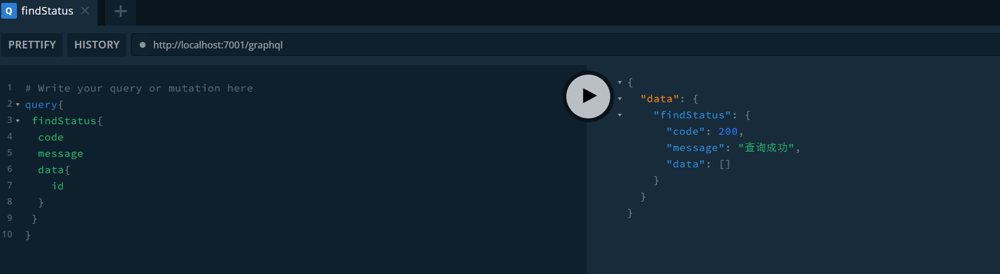
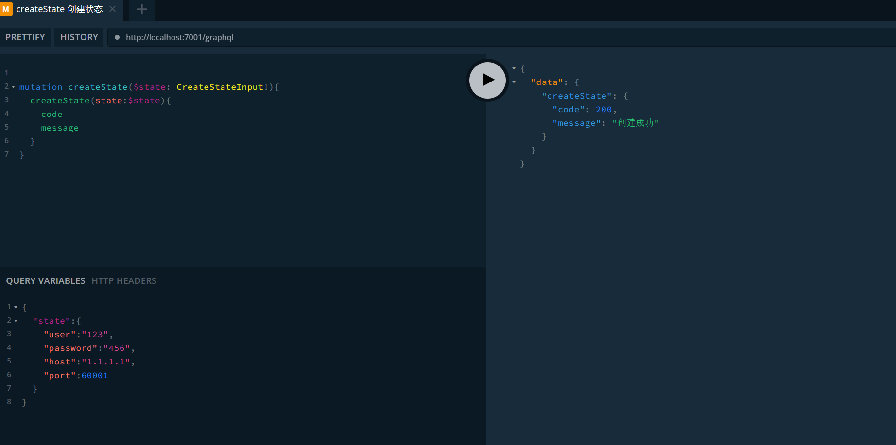
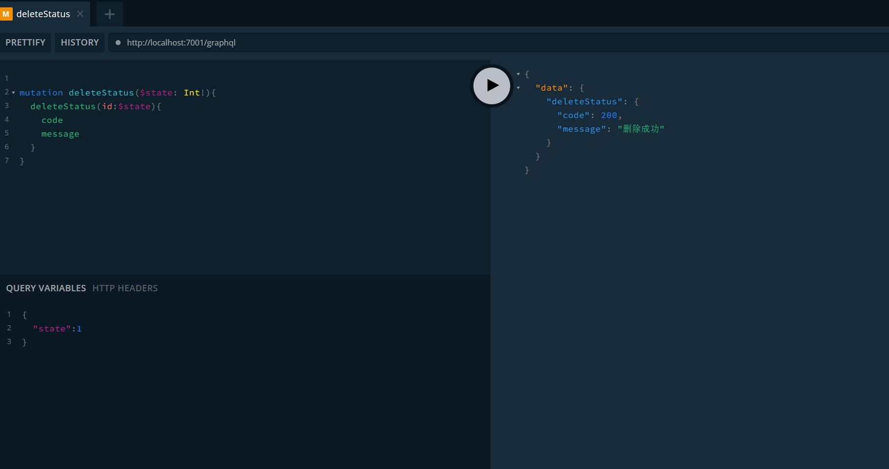
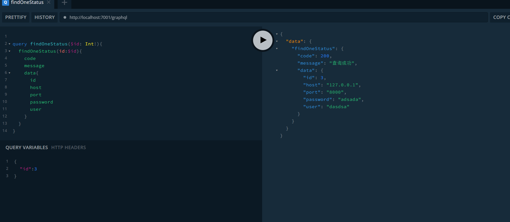
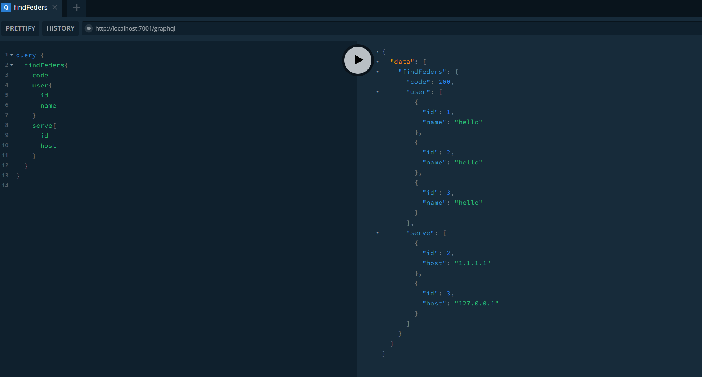

# features

- Data aggregation and clipping.
  - graphql
    - Introducing DataLoader to solve the N+1 problem in GraphQL.
    - GraphQL caching.
- SSR.
- Screenshots.
- Uploading and downloading.
  - large file slicing.
  - resume transfer.
- Interface forwarding.
- Micro service.
- The backend will be refactored using the Go framework Gin.

# GraphQL Playground Request Demo

- search all
  
- create
  
- delete
  
- search one
  
- federation interface
  
